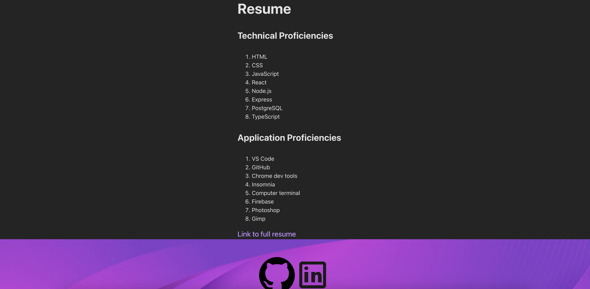

# Portfolio Project

Welcome to my portfolio project! This is a comprehensive showcase of my work, skills, and professional background. The project highlights my coding expertise, creative problem-solving, and ability to bring ideas to life.

---

## **Table of Contents**

1. [Preview](#preview)
2. [About Me](#about-me)
3. [Portfolio](#portfolio)
4. [Contact](#contact)
5. [Resume](#resume)
6. [Technologies Used](#technologies-used)

---

## **Preview**

---

## **About Me**

I am a passionate and dedicated software developer with a strong focus on creating user-friendly, functional, and visually appealing applications. My experience spans a variety of technologies, including **React**, **TypeScript**, **Node.js**, and **CSS**, with a particular interest in front-end development. Beyond coding, I have a background in customer service and IT internships, which has honed my skills in communication and collaboration.

---

## **Portfolio**

### **Projects**

#### 1. **Vinyl Vault**  
   A web application for managing and cataloging a collection of vinyl records.
   - **GitHub Repository:** [Vinyl Vault GitHub](https://github.com/KatanaFinKoi/Vinyl-Vault)  
   - **Live Deployment:** [Vinyl Vault Live](https://vinyl-vault-1.onrender.com)

#### 2. **Dead by Daylight Character Profiles**  
   An interactive guide to character profiles and lore in the game Dead by Daylight.
   - **GitHub Repository:** [Dead by Daylight GitHub](https://github.com/KatanaFinKoi/Dead-by-Daylight-project)  
   - **Live Deployment:** [Dead by Daylight Live](https://katanafinkoi.github.io/Dead-by-Daylight-project/)

#### 3. **Mark Warner Digital Memorial**  
   A digital memorial platform honoring Mark Warner.
   - **GitHub Repository:** [Mark Warner GitHub](https://github.com/KatanaFinKoi/Mark-Warner-Digital-Memorial)  
   - **Live Deployment:** [Mark Warner Live](https://mark-warner-digital-memorial.web.app/)

Each project demonstrates my skills in full-stack development, responsive design, and the use of modern web technologies.

---

## **Contact**

This section includes a contact form for reaching out directly:

### Contact Form
- Fields: Name, Email, Message
- Features:
  - Required field validation.
  - Email validation with real-time error notifications.

To contact me, fill out the form on the deployed portfolio or use the provided email notifications.

---

## **Resume**

View my full resume for details about my experience, education, and skills.  
- **View Resume:** [My Resume](https://docs.google.com/document/d/17l0d5-J0_HpLV334MfrZXLaSIqSylvKw9eUz8eV4-Gw/edit?usp=sharing)

---

## **Technologies Used**

This portfolio is built using:
- **React** **TypeScript** and **Vite** for dynamic and type-safe UI development.
- **CSS** for responsive design and styling.
- **Netlify** for deployment and form handling.

Thank you for taking the time to explore my portfolio! Feel free to reach out through the contact form or connect with me via my social links.
